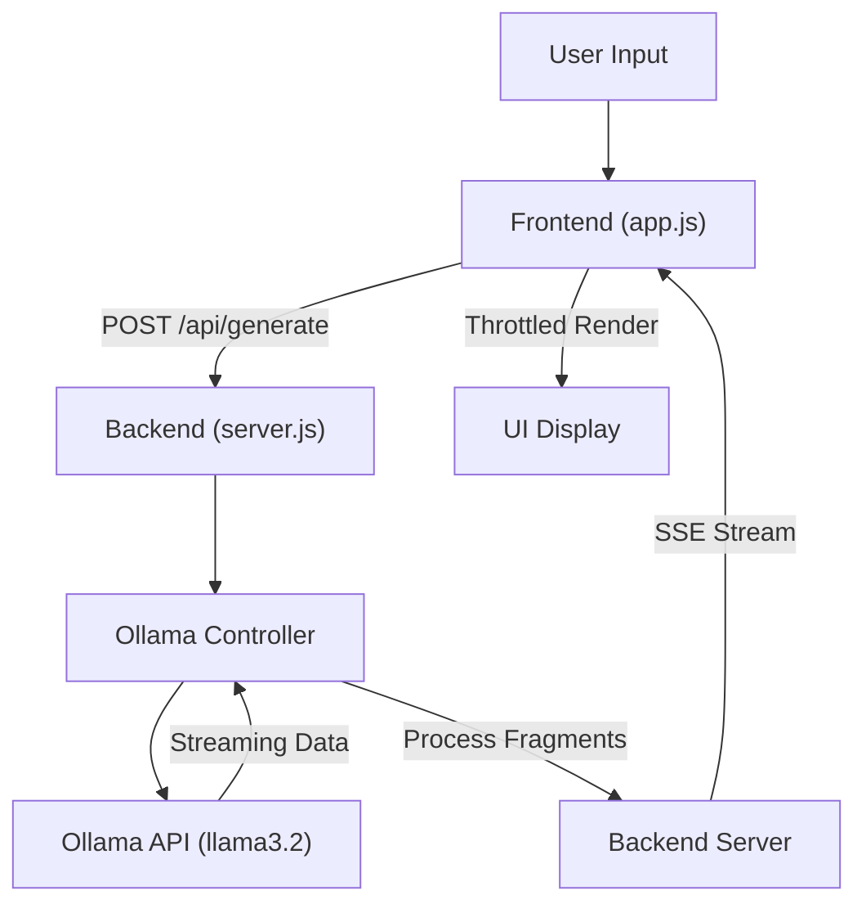

# 🚀 Local LLM Test Case Generator

A professional, privacy-focused test case generation tool powered by **llama3.2** running locally via Ollama. Built using the **B.L.A.S.T.** (Blueprint, Link, Architect, Stylize, Trigger) protocol and **A.N.T.** 3-layer architecture.

[](https://opensource.org/licenses/MIT)
[](https://nodejs.org/)
[](https://ollama.ai/)

---

## 📋 Overview

This application allows QA engineers and developers to generate detailed, structured test cases using a Large Language Model running completely **offline** on your local machine. No data leaves your system, ensuring complete privacy and security.

### ✨ Key Features

- 🔒 **100% Local & Private** - All processing happens on your machine
- 🤖 **AI-Powered** - Powered by llama3.2 via Ollama
- 🎨 **Premium UI** - Modern, dark-themed interface with glassmorphism
- 📝 **Structured Output** - Generates test cases in standardized format
- ⚡ **Fast & Efficient** - No API rate limits or costs
- 🛠️ **B.L.A.S.T. Protocol** - Built with systematic, maintainable architecture

---

## 🔄 Process Flow



---

## 🎯 Use Cases

- Generate test cases from user stories or requirements
- Create edge case scenarios automatically
- Generate positive and negative test flows
- Speed up QA documentation process
- Standardize test case formatting across teams

---

## 🏗️ Tech Stack

| Component | Technology |
|-----------|-----------|
| **Backend** | Node.js + Express |
| **Frontend** | HTML5, CSS3, Vanilla JavaScript |
| **AI Model** | llama3.2 (via Ollama) |
| **Architecture** | B.L.A.S.T. Protocol + A.N.T. 3-Layer |
| **Styling** | Custom CSS with Glassmorphism |

---

## 📦 Prerequisites

Before running this application, ensure you have:

1. **Node.js** (v18 or higher)
   - Download: https://nodejs.org/

2. **Ollama** installed and running
   - Download: https://ollama.ai/
   - Install llama3.2 model:
     ```bash
     ollama pull llama3.2
     ```

3. **Git** (for cloning the repository)
   - Download: https://git-scm.com/

---

## 🚀 Installation

### Step 1: Clone the Repository

```bash
git clone https://github.com/manoj8759/Project-1_LocalTestCaseGenerator.git
cd Project-1_LocalTestCaseGenerator
```

### Step 2: Install Dependencies

```bash
npm install
```

### Step 3: Verify Ollama is Running

Make sure Ollama is running on your system:

```bash
ollama serve
```

### Step 4: Start the Application

```bash
node backend/server.js
```

The server will start on **http://localhost:3000**

---

## 💻 Usage

1. Open your browser and navigate to: **http://localhost:3000**

2. Enter your requirement or user story in the chat interface, for example:
   ```
   Generate test cases for a login feature with email and password
   ```

3. Click **Generate** or press Enter

4. The AI will return formatted test cases with:
   - **Test Case ID**
   - **Title**
   - **Description**
1.  Open your browser and navigate to: **http://localhost:3000**

2.  Enter your requirement or user story in the chat interface, for example:
    ```
    Generate test cases for a login feature with email and password
    ```

3.  Click **Generate** or press Enter

4.  The AI will return formatted test cases with:
    -   **Test Case ID**
    -   **Title**
    -   **Description**
    -   **Preconditions**
    -   **Steps**
    -   **Expected Results**

5.  Copy the generated test cases to your test management tool

---

## 📁 Project Structure

```
Project-1_LocalTestCaseGenerator/
├── .gitignore              # Git ignore file
├── BLAST.md                # B.L.A.S.T. protocol documentation
├── README.md               # This file
├── package.json            # Node.js dependencies
├── backend/                # Backend logic
│   ├── server.js           # Express server
│   ├── config.js           # Configuration constants
│   └── controllers/        # Logical controllers
├── frontend/               # UI assets
│   ├── index.html          # Main HTML
│   ├── style.css           # Premium styling
│   └── app.js              # UI Logic
├── gemini.md               # Project constitution & schemas
├── task_plan.md            # Project phases & checklist
├── progress.md             # Development progress log
└── findings.md             # Research & discoveries
```

---

## 🎨 Test Case Output Format

The application generates test cases in this standardized format:

```markdown
**Test Case ID**: TC_001
**Title**: Verify login with valid credentials
**Description**: Test that users can successfully log in with correct email and password
**Preconditions**:
- User account exists in the system
- User has valid email and password

**Steps**:
1. Navigate to login page
2. Enter valid email address
3. Enter correct password
4. Click "Login" button

**Expected Result**: User is successfully logged in and redirected to dashboard
```

---

## 🛠️ B.L.A.S.T. Protocol

This project follows the **B.L.A.S.T.** methodology:

- **B**lueprint - Define data schemas and architecture before coding
- **L**ink - Verify all API connections and integrations
- **A**rchitect - Build using 3-layer architecture (SOPs, Navigation, Tools)
- **S**tylize - Professional UI/UX and output formatting
- **T**rigger - Deploy and automate

Learn more in [BLAST.md](BLAST.md)

---

## 🔧 Configuration

### Change the Port

Edit `server.js` and modify:

```javascript
const PORT = 3000; // Change to your desired port
```

### Use a Different Model

Edit `server.js` and change:

```javascript
const MODEL = 'llama3.2'; // Change to any Ollama model
```

### Customize System Prompt

Modify the `SYSTEM_PROMPT` in `server.js` to change how test cases are generated.

---

## 🐛 Troubleshooting

### Issue: "Cannot connect to localhost:3000"
**Solution**: Make sure the server is running with `node server.js`

### Issue: "Model 'llama3.2' not found"
**Solution**: Install the model with `ollama pull llama3.2`

### Issue: "Failed to generate test cases"
**Solution**: Ensure Ollama is running with `ollama serve`

---

## 🤝 Contributing

Contributions are welcome! Please feel free to submit a Pull Request.

1. Fork the repository
2. Create your feature branch (`git checkout -b feature/AmazingFeature`)
3. Commit your changes (`git commit -m 'Add some AmazingFeature'`)
4. Push to the branch (`git push origin feature/AmazingFeature`)
5. Open a Pull Request

---

## 📝 License

This project is licensed under the MIT License - see the [LICENSE](LICENSE) file for details.

---

## 👨‍💻 Author

**Manoj Yadav**

- GitHub: [@manoj8759](https://github.com/manoj8759)
- Email: Manoj8759@gmail.com

---

## 🙏 Acknowledgments

- Built with [Ollama](https://ollama.ai/) for local LLM inference
- Follows the B.L.A.S.T. protocol for systematic development
- Inspired by the need for privacy-focused AI tools

---

## 📊 Roadmap

- [ ] Add support for multiple test case formats (JSON, CSV, Excel)
- [ ] Implement test case history and saved sessions
- [ ] Add templating for different testing methodologies
- [x] Support for streaming responses ✅
- [ ] Export to popular test management tools (Jira, TestRail)
- [ ] Multi-language support

---

## ⭐ Star This Repository

If you find this project useful, please consider giving it a star on GitHub! It helps others discover this tool.

---

**Made with ❤️ for the QA community**
